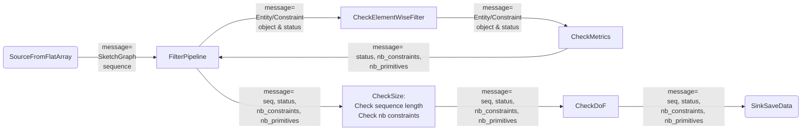
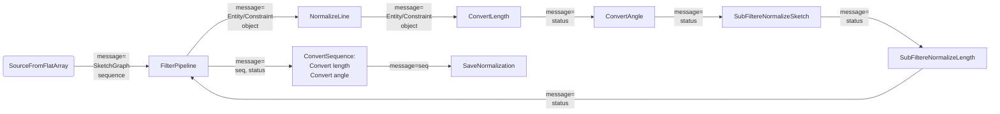

# SketchGraph: data preprocessing

La pipeline de preprocessing s'appuie sur 4 grandes étapes :
A. Une étape de filtrage selon les critéres détaillés ci-dessous,
B. Une étape de normalisation des données,
C. Une étape finale de tri dont le but est de retirer les esquisses les plus proches,
D. Une étape de conversion dans un format binaire compatible pour l'entraînement avec un modèle torch.

L'intégralité de l'étape de preprocessing permet de générer à partir d'un fichier binaire .npy contenant des esquisses au format SketchGraph un nouveau fichier binaire compatible pour un entraînement avec pytorch.

# A. Filtration des données

Les données sont filtrés selon les critères suivants :

a. un Noeud doit appartenir à la liste suivante (9 éléments):
```python
    keep_node = [datalib.EntityType.Point, datalib.EntityType.Line,
              datalib.EntityType.Circle, datalib.EntityType.Arc,
             datalib.SubnodeType.SN_Start, datalib.SubnodeType.SN_End, datalib.SubnodeType.SN_Center,
             datalib.EntityType.External, datalib.EntityType.Stop]
```

b. une Arête appartenir à la liste suivante (15 éléments):
```python
    keep_edge = [datalib.ConstraintType.Coincident, datalib.ConstraintType.Distance, datalib.ConstraintType.Horizontal,
             datalib.ConstraintType.Parallel, datalib.ConstraintType.Vertical, datalib.ConstraintType.Tangent,
             datalib.ConstraintType.Length, datalib.ConstraintType.Perpendicular, datalib.ConstraintType.Midpoint,
             datalib.ConstraintType.Equal, datalib.ConstraintType.Diameter, datalib.ConstraintType.Radius,
             datalib.ConstraintType.Concentric, datalib.ConstraintType.Angle, datalib.ConstraintType.Subnode]
```

c. une contrainte ne doit pas avoir 3 références

d. la séquence doit contenir au moins une contrainte

e. la séquence doit avoir nbre de noeuds compris entre ```n_min``` et ```n_max```.

f. la séquence doit avoir un DoF inférieur ou égale à ```dof_max```

g. les angles doivent être en degrés et les distances en métres

*Remarques :* 
- Le test sur la référence est == et non >=. Doit-on modifier ce test ? 
- Des étapes de filtrations sont également contenues dans la partie normalization du code d'Odilon. Il paraît plus logique de les basculer dans le A.


**Dans notre pipeline de preprocessing**
- les filtres a., b., c. et g. sont des filtres s'appliquant opération par opération.
- les filtres  d., e. et f. sont des filtres s'appliquant sur l'intégralité de la séquence. Pour les filtres d. et e., il y a un phénomène d'accumulations.

Par conséquent, nous proposons la construction suivante :




# B. Normalization des données 

Une fois l'étape de filtrage effectuée, le dataset est normalisé selon les critères suivants :

a. Normalization des segments (Constraint Line) - [FilterRecenterLine](../src/filters/filter_recenterline.py)

b. Centrer l'esquisse - [FilterBarycenter](../src/filters/filter_barycenter.py)

c. Conversion des longueurs en mètre - [FilterConvertMetrics](../src/filters/filter_convertmetrics.py)

d. Conversion des angles en degrès - [FilterConvertMetrics](../src/filters/filter_convertmetrics.py)

e. Normalization des longueurs - [FilterDivByMax](../src/filters/filter_divbymax.py)

f. Conversion des angles pour les noeuds Arc et les contraintes Angle - [FilterModuloAngle](../src/filters/.py)

**Dans notre pipeline de preprocessing**
- les filtres a., c., d. et f. sont des filtres s'appliquant opération par opération.
- les filtres  b. et e. sont des filtres s'appliquant sur l'intégralité de la séquence (mais avec un phénomène d'accumulation)

