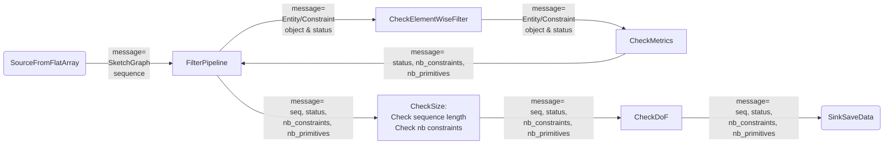
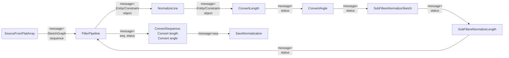

# SketchGraph: data preprocessing

La pipeline de preprocessing s'appuie sur 4 grandes étapes :

* A. Une étape de filtrage
* B. Une étape de normalisation des données,
* C. Une étape finale de tri dont le but est de retirer les esquisses les plus proches,
* D. Une étape de conversion dans un format binaire compatible pour l'entraînement avec un modèle torch.

L'intégralité de l'étape de preprocessing permet de générer à partir d'un fichier binaire .npy contenant des esquisses au format SketchGraph un nouveau fichier binaire compatible pour un entraînement avec pytorch.

# A. Filtration des données

Les données sont filtrés selon les critères suivants :

### a. un Noeud doit appartenir à la liste suivante (9 éléments):
```python
    keep_node = [EntityType.Point, EntityType.Line,
              EntityType.Circle, EntityType.Arc,
             SubnodeType.SN_Start, SubnodeType.SN_End, SubnodeType.SN_Center,
             EntityType.External, EntityType.Stop]
```

### b. une Arête doit appartenir à la liste suivante (15 éléments):
```python
    keep_edge = [ConstraintType.Coincident, ConstraintType.Distance, ConstraintType.Horizontal,
             ConstraintType.Parallel, ConstraintType.Vertical, ConstraintType.Tangent,
             ConstraintType.Length, ConstraintType.Perpendicular, ConstraintType.Midpoint,
             ConstraintType.Equal, ConstraintType.Diameter, ConstraintType.Radius,
             ConstraintType.Concentric, ConstraintType.Angle, ConstraintType.Subnode]
```

### c. une contrainte ne doit pas avoir 3 références

### d. la séquence doit contenir au moins une contrainte

### e. la séquence doit avoir nbre de noeuds compris entre ```n_min``` et ```n_max```.

### f. la séquence doit avoir un DoF inférieur ou égale à ```dof_max```

### g. les angles doivent être en degrés et les distances en métres

**Dans notre pipeline de preprocessing**
- les filtres a., b., c. et g. sont des filtres s'appliquant opération par opération.
- les filtres  d., e. et f. sont des filtres s'appliquant sur l'intégralité de la séquence. Pour les filtres d. et e., il y a un phénomène d'accumulations.

Par conséquent, nous proposons la construction suivante :




# B. Normalization des données 

Une fois l'étape de filtrage effectuée, le dataset est normalisé selon les critères suivants :

### a. Normalization des segments (Constraint Line) - [FilterRecenterLine](../src/filters/filter_recenterline.py).
Sketchgraphs encode les lignes avec un point au milieu (pntX, pntY), une direction (dirX, dirY) et une longueur dans chaque direction (startParam = -endParam = lenght/2). Les Lines sont converties de façon à avoir un point au départ et une seule longueur.

### b. Centrer l'esquisse - [FilterBarycenter](../src/filters/filter_barycenter.py)
Les coordonnées des primitives sont recentrées autour d'un barycentre. Le calcul du barycentre ne prend en compte que les coordonnées du point de construction de la primitive. Il pourrait être intéressant de calculer un barycentre plus intuitif

### c. Conversion des longueurs en mètre - [FilterConvertMetrics](../src/filters/filter_convertmetrics.py)
Les valeurs des paramètres 'length' initialement en string sont converties en float.

### d. Conversion des angles en degrès - [FilterConvertMetrics](../src/filters/filter_convertmetrics.py)
Idem pour le paramètres 'angle' des contraintes angulaires

### e. Normalization des longueurs - [FilterDivByMax](../src/filters/filter_divbymax.py)
Les longueurs sont divisées par le maximum en valeur absolue

### f. Conversion des angles pour les noeuds Arc et les contraintes Angle - [FilterModuloAngle](../src/filters/filter_moduloangle.py)
Les angles sont replacés dans [0;2pi]

**Dans notre pipeline de preprocessing**
- les filtres a., c., d. et f. sont des filtres s'appliquant opération par opération.
- les filtres  b. et e. sont des filtres s'appliquant sur l'intégralité de la séquence (mais avec un phénomène d'accumulation)



# C.  Clustering

L'objectif est de rassembler les séquences similaires et d'attribuer un poids à chaque séquence pour le dataloader

## Clustering 1: clustering sur la séquence​

### [SourceFromFlatArray](../src/sources/source_fromflatarray.py)
Lit les séquences une à une

### [FilterOpEncoding](../src/filters/filter_sequenceorderencoding.py)
Encoding de chaque operation​ par un nombre

### [FilterSequenceOrderEncoding](../src/filters/filter_sequenceorderencoding.py)
Encoding de l’ordre de la sequence​ (passage en string)

### [FilterClusterOrder](../src/filters/filter_clustersequences.py)
"Clustering" sur cet encoding (rassembler les séquences partageant le même encoding)​
    ​
### [SinkDict](../src/filters/sink_dict.py)
Sauvegarde les indices des séquences par cluster dans un dictionnaire


## Clustering 2: clustering sur les paramètres​
 ​
### [SourceFromDict](../src/sources/source_fromdict.py):
Lit séquentiellement les clusters du dictionnaire​. Renvoie la liste de toutes les séquences du cluster

### [FilterParamsEncoding](../src/filters/filter_paramsencoding.py)
Encoding des paramètres​ dans une array

### [FilterClusterParamValues](../src/filters/filter_clusterparamvalues.py)
Clustering​ (scipy)

### [SinkArray](../src/filters/sink_array.py)
Sauvegarde les weights dans une array npy


# D. Encoding

La dernière étape de la pipeline encode les données en tenseurs torch et array numpy pour pouvoir les donner au modèle

### [SourceFromFlatArray](../src/sources/source_fromflatarray.py)
Lit les séquences une à une

### [FilterEncodeNodeFeatures](../src/filters/filter_encodenodefeatures.py)
Encode les features liées au noeuds et à leurs paramètres

### [FilterEncodeEdgeFeatures](../src/filters/filter_encodeedgefeatures.py)
Encode les features liées aux arêtes et à leurs paramètres

### [FilterEncodeIncidences](../src/filters/filter_encodeincidences.py)
Encode les données d'adjacence du graphe

### [SinkDictFlat](../src/filters/sink_dictflat.py)
Sauvegarde les données sous la forme d'une liste de dictionnaires. Les fichiers sont découpés en slices puis regroupés.


